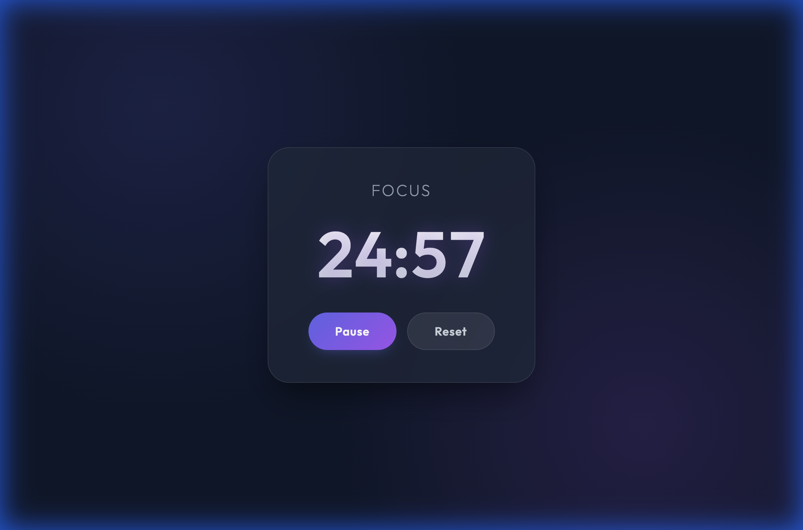

# Pomodoro Timer

A beautifully designed, single-file Pomodoro timer focused on aesthetics and simplicity. Built with vanilla HTML, CSS, and JavaScript.

## Overview

This application helps you stay focused by implementing the Pomodoro Technique. It features a clean, glassmorphism-inspired interface with a premium dark mode aesthetic. Ideally suited for anyone who wants a distraction-free focus tool without installing heavy applications or extensions.

## Features

- **25-Minute Focus Cycles**: Standard Pomodoro duration to maximize productivity.
- **Audio Alarm**: Plays a pleasant double-beep sound when the timer ends using the Web Audio API. No external audio files required.
- **Responsive Design**: Looks great on desktop and mobile with a centered, glass-effect card.
- **Visual Feedback**:
    - "Focus" mode indicator.
    - Dynamic start/pause button states.
    - Subtle pulse animation while the timer is active.
    - Browser tab title updates with remaining time.

## How to Use

1.  **Open the App**: Simply open `index.html` in any modern web browser.
2.  **Start Focus**: Click the **Start** button to begin the 25-minute countdown.
3.  **Pause/Resume**: Click **Pause** to take a break or handle an interruption. Click **Start** again to resume.
4.  **Complete**: When the timer hits 00:00, an alarm will sound. Take a break!
5.  **Reset**: Click **Reset** at any time to return the timer to 25:00.

## Technologies Used

- **HTML5**: Semantic markup.
- **CSS3**: Variables, Flexbox, Gradients, Backdrop Filter (Glassmorphism), Keyframe Animations.
- **JavaScript (ES6+)**: `setInterval` for timing, Web Audio API for sound generation.
- **Typeface**: [Outfit](https://fonts.google.com/specimen/Outfit) from Google Fonts.

## License

MIT
